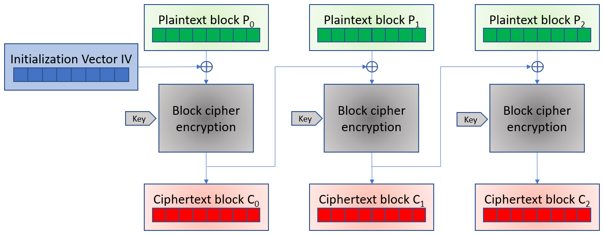
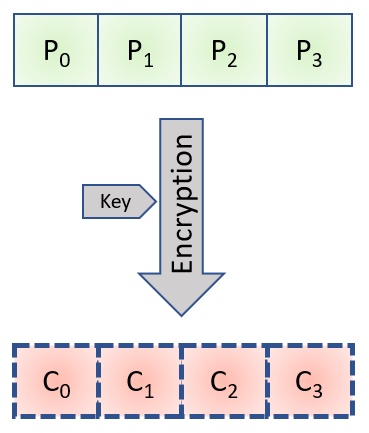

# Padding Oracle Attack Explained
Padding Oracle attack fully explained and coded from scratch in Python3.

------ Page Under Construction -------


### Summary  

1- Overview   
2- Script Usage    
3- AES-CBC Ciphering    
4- Exploiting CBC mode    
5- Padding Oracle Attack    

* * *
## 1- Overview

The padding oracle attack is a spectacular attack because it allows to decrypt a message that has been intercepted if the message was encrypted using CBC mode. 
It will only require being able to ensure that we are able to obtain a response from the server that will serve as an Oracle (we'll come back to these in more detail later in this report). We will then be able to decrypt the entire message except the first block, un less you know the initialization vector.   

In this article, we will focus on how to use this vulnerability and propose a python script that decrypts a message encrypted in AES-CBC.

* * *
## 2- Script Usage

If you're only insterested in using the code, the chapter 2 is all you need. However, please note that this code consider that you know the initialization vector, which is usually wrong in real life

Get the program by downloading this repository or:
~~~
$ git clone https://github.com/flast101/padding-oracle-attack-explained.git
~~~

Cryptographic parameters can be changed in `settings.py`

Encyption and decryption using AES-CBC alogorithm:
~~~
$ python3 aescbc.py <message>         encrypts and displays the message (output in hex format)
$ python3 aescbc.py -d <hex code>      decrypts and displays the message
~~~

Decrypting an message using the padding oracle attack:
~~~
$ python3 poracle_exploit.py <message>         decrypts and displays the message
~~~

`oracle.py` is our oracle: a boolean function determining if the message is encrypted with valid PKCS7 padding .


## Example

~~~
root@kali:~# python3 poracle_exploit.py dfd117358343ca9b36e58abec333349d753937af1781b532404c8b29b25d4de24661995fb5dcb06528a15b4eed172d7410c28b5f38cd0af834afdbe5b9ff36a1c516c8a1cb7ad4e32a122ea918aeca60
Decrypted message:  Try harder ! The quieter you become the more you are able to hear.
~~~


* * * 
## 3- AES-CBC Ciphering
### 3.1- Advanced Encryption Standard (AES)
Safeguarding information has become an indispensable measure in today’s cybersecurity world. Encryption is one such method to protect discreet information being transferred online.

The Advanced Encryption Standard (AES), also known by its original name Rijndael (Dutch pronunciation: [ˈrɛindaːl]),[3] is a specification for the encryption of electronic data established by the U.S. National Institute of Standards and Technology (NIST) in 2001.

The Encryption technique is employed in two ways, namely symmetric encryption and asymmetric encryption. For symmetric encryption, the same secret key is used for both encryption and decryption, while asymmetric encryption has one key for encryption and another one for decryption.

With regard to symmetric encryption, data can be encrypted in two ways. There are stream ciphers: any length of data can be encrypted, and the data does not need to be cut. The other way is block encryption. In this case, the data is cut into fixed size blocks before encryption.

There are several operating modes for block encryption, such as Cipher Block Chaining (CBC), as well as CFB, ECB... etc.


### 3.2- Cipher Block Chaining (CBC)
In CBC mode, each block of plaintext is XORed with the previous ciphertext block before being encrypted. This way, each ciphertext block depends on all plaintext blocks processed up to that point. To make each message unique, an initialization vector must be used in the first block. 

CBC has been the most commonly used mode of operation, in applications such as VPN with OpenVPN or IPsec. Its main drawbacks are that encryption is sequential (i.e., it cannot be parallelized), and that the message must be **padded** to a multiple of the cipher block size.



If the first block has the index 0, the mathematical formula for CBC encryption is:

**C<sub>i</sub> = E<sub>K</sub> (P<sub>i</sub> ⊕ C<sub>i-1</sub>) for i ≥ 1,     
C<sub>0</sub> = E<sub>K</sub> (P<sub>0</sub> ⊕ IV)**

Where E<sub>K</sub> is the function of encryption with the key K and C<sub>0</sub> is equal to the initialization vector.


Decrypting with the incorrect IV causes the first block of plaintext to be corrupt but subsequent plaintext blocks will be correct. This is because each block is XORed with the ciphertext of the previous block, not the plaintext, so one does not need to decrypt the previous block before using it as the IV for the decryption of the current one. This means that a plaintext block can be recovered from two adjacent blocks of ciphertext. 


* * *
## 4.- Exploiting CBC mode
### 4.1- PKCS7 padding validation function

The padding mainly used in block ciphers is defined by PKCS7 (Public-Key Cryptography Standards) whose operation is described in RFC 5652.   
Let N bytes be the size of a block. If M bytes are missing in the last block, then we will add the character ‘0xM’ M times at the end of the block.

Here, we want to write a function which takes as input clear text in binary and which returns a boolean validating or invalidating the fact that the fact that this text is indeed a text with a padding in accordance with PKCS7.   
The function is exposed in the code which follows under the name **_pkcs7_padding_**. It determines whether the input data (unencrypted text) may or may not meet PKCS7 requirements.

```python
def pkcs7_padding(data):
    pkcs7 = True
    last_byte_padding = data[-1]
    if(last_byte_padding < 1 or last_byte_padding > 16):
        pkcs7 = False
    else:
        for i in range(0,last_byte_padding):
            if(last_byte_padding != data[-1-i]):
                pkcs7 = False
    return pkcs7
```

### 4.2- Ask the Oracle

Here, we want to perform a function that determines whether an encrypted text corresponds to PKCS7 padding valid encrypted data. This Oracle function will abundantly serve us in the manipulation allowing to exploit the fault due to padding.

```python
def oracle(encrypted):
    return pkcs7_padding(decryption(encrypted))
```

### 4.3- CBC mode vulnerability





* * *
## 5- Padding Oracle Attack


Happy hacking !   :smiley:

